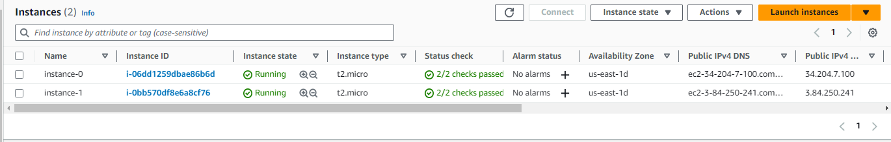
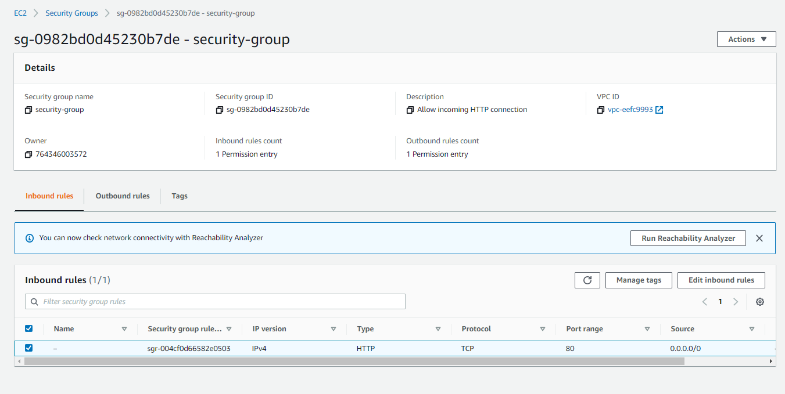
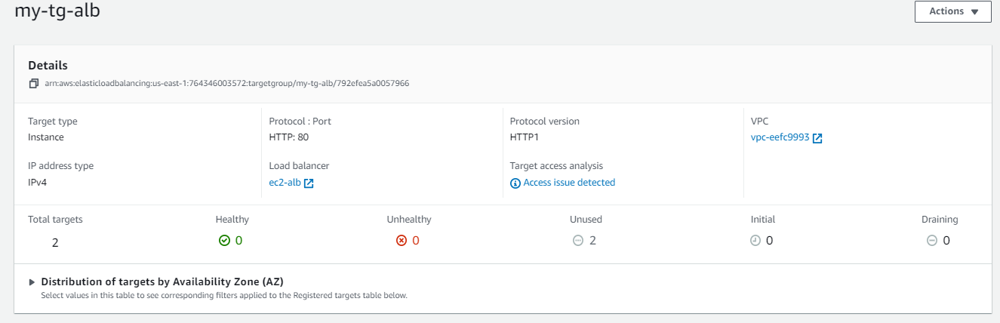
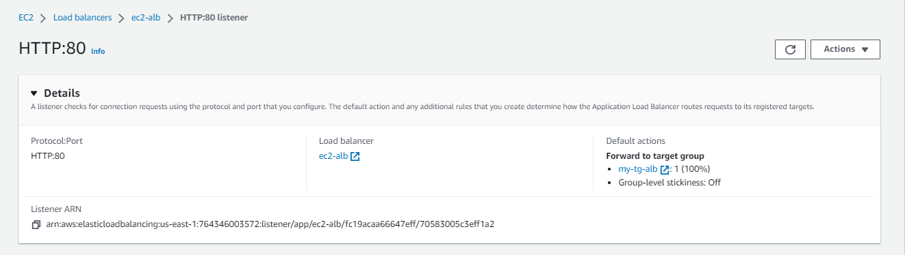
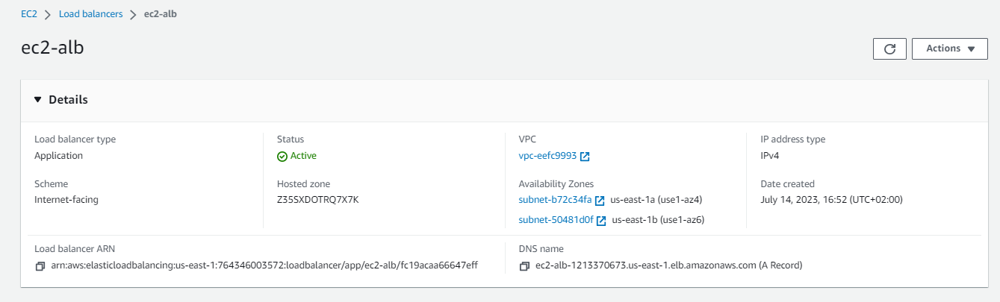

# ALB-using-terraform

Project Description: Creating an Application Load Balancer on AWS to distribute incoming traffic between two EC2 instances using terraform

Section 1:
1. Log in to your AWS Management Console.
2. Navigate to the EC2 service.
3. Click on Launch EC2 instances button on the right hand side of your screen, proceed with configuration of EC2 instances as per your need and launch instances.

The same instances can be launched using terraform as follows:

# Creating security group to assure who can access our EC2 instances

resource "aws_security_group" "my_SG" {

    name = "security-group" 
    description = "Allow incoming HTTP connection"
    ingress {
        from_port = 80
        to_port   = 80
        protocol  = "tcp"
        cidr_blocks = ["0.0.0.0/0"]
    }

    egress {
        from_port = 0
        to_port = 0
        protocol = "-1"
        cidr_blocks = ["0.0.0.0/0"]
    }

}

# Creating 2 EC2 instances and adding security group to it

resource "aws_instance" "my_ec2" {
    
    ami             = "ami-01cc34ab2709337aa"
    instance_type   = "t2.micro"
    count           = 2
    security_groups = ["${aws_security_group.my_SG.name}"]
    user_data       = <<-EOF
    #!/bin/bash
    sudo su
    yum update -y
    yum install -y httpd 
    systemctl start httpd
    systemctl enable httpd
     echo "<h1> Hello from my server $(hostname -f ) </h1>" >> /var/www/html/index.html
     EOF
     tags = {
        Name = "instance-${count.index}"
     }
}

Section 2:
1. Go to the EC2 dashboard and click on "Load Balancers" in the navigation pane.
2. Click the "Create Load Balancer" button.
3. Select "Application Load Balancer" as the load balancer type.
4. Configure the load balancer settings, including:
   - Assign a name to the load balancer.
   - Choose scheme as "Internet-facing" if your load balancer will be accessible from the internet and Ip address type as IPv4.
5. Under Network mapping
   - Choose the required VPC and availability zones
6. Under Security group 
   - Add appropriate security groups to allow incoming traffic to the load balancer.
7. For Listener and routing section 
   - Create a new target group  where to need to route the traffic (A shortcut to navigate to target groups is available on the screen just click on that) .
   - On the Specify group details page,  Select "Instance" as the target type.
   - Give a suitable name under Target group name
   - Choose the protocol as HTTP on port 80
   -  Configure health checks to monitor the health of your EC2 instances.
   -  Go to the next page select both the instances and register them as targets and click create target group
10. Review the configuration and click "Create" to create the load balancer.
11. Wait for the load balancer's status to become "Active."
12. Once the load balancer is active, you can access your application using the load balancer's DNS name.

The above configuration can be achieved using terraform as follows:

# data blocks are used here to retrieve information about vpc in this case we are using the default vpc

data "aws_vpc" "default" {
  default = true
}

data "aws_subnet" "subnet1" {
 vpc_id = data.aws_vpc.default.id
 availability_zone = "us-east-1a"
}

data "aws_subnet" "subnet2" {
 vpc_id = data.aws_vpc.default.id
 availability_zone = "us-east-1b"
}

# Creating our EC2 instances as the target 

resource "aws_lb_target_group" "target-group" {

    health_check {
        interval = 10
        path = "/"
        protocol = "HTTP"
        timeout = 5
        healthy_threshold = 5
        unhealthy_threshold = 2
    }

    name = "my-tg-alb"
    port = 80
    protocol = "HTTP"
    target_type = "instance"
    vpc_id = data.aws_vpc.default.id
}

 
# Creating Listener

resource "aws_lb_listener" "alb-listener" {

    load_balancer_arn          = aws_lb.my_alb.arn
    port                       = 80
    protocol                   = "HTTP"
    default_action {
        target_group_arn         = aws_lb_target_group.target-group.arn
        type                     = "forward"
    }
}	

# Creating Application Load Balancer

resource "aws_lb" "my_alb" {

    name            = "ec2-alb"
    internal        = false
    ip_address_type     = "ipv4"
    load_balancer_type = "application"
    security_groups = [aws_security_group.my_SG.id]
    subnets = [
                data.aws_subnet.subnet1.id,
                data.aws_subnet.subnet2.id
                ]
    tags = {
        Name = "alb"
    }
}

# Attaching Target group to ALB

resource "aws_lb_target_group_attachment" "ec2_and_tg_attach" {

    count = length(aws_instance.my_ec2)
    target_group_arn = aws_lb_target_group.target-group.arn
    target_id        = aws_instance.my_ec2[count.index].id
}	

#Testing
To ensure that the load balancer is distributing traffic correctly:

1. Access your application using the load balancer's DNS name.
2. Monitor the traffic distribution by checking the access logs and verifying that requests are being forwarded to both EC2 instances.
3. Test the high availability of your application by stopping one of the EC2 instances. Requests should automatically be routed to the available instance.
